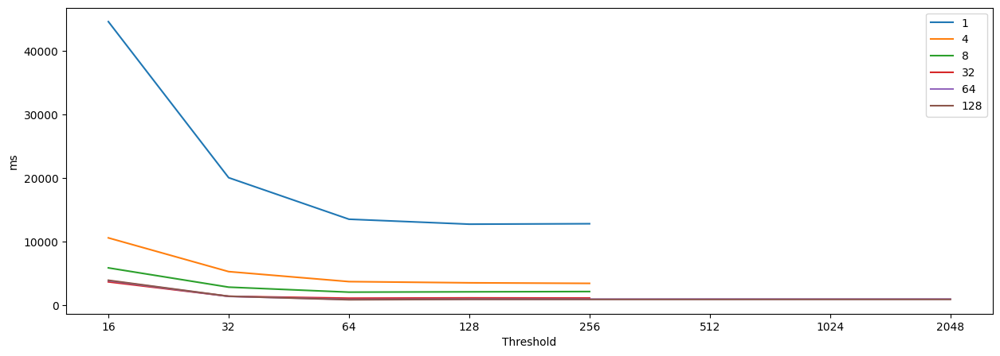

# Parallelizing the Wikipedia search engine

Small project for the Parallelism and Distribution course.
Parallel search of a large database and sorting of the results.

Threshold refers to the sequential threshold T used and the legend contains the number of logical cores used.
The dataset can be found [here](https://www.kaggle.com/datasets/ltcmdrdata/plain-text-wikipedia-202011/data/).

(Runtimes were measured using a 128gb RAM, Ryzen Threadripper 3990x CPU using Ubuntu 22.04.4 LTS and Java openjdk version 19.0.2)
